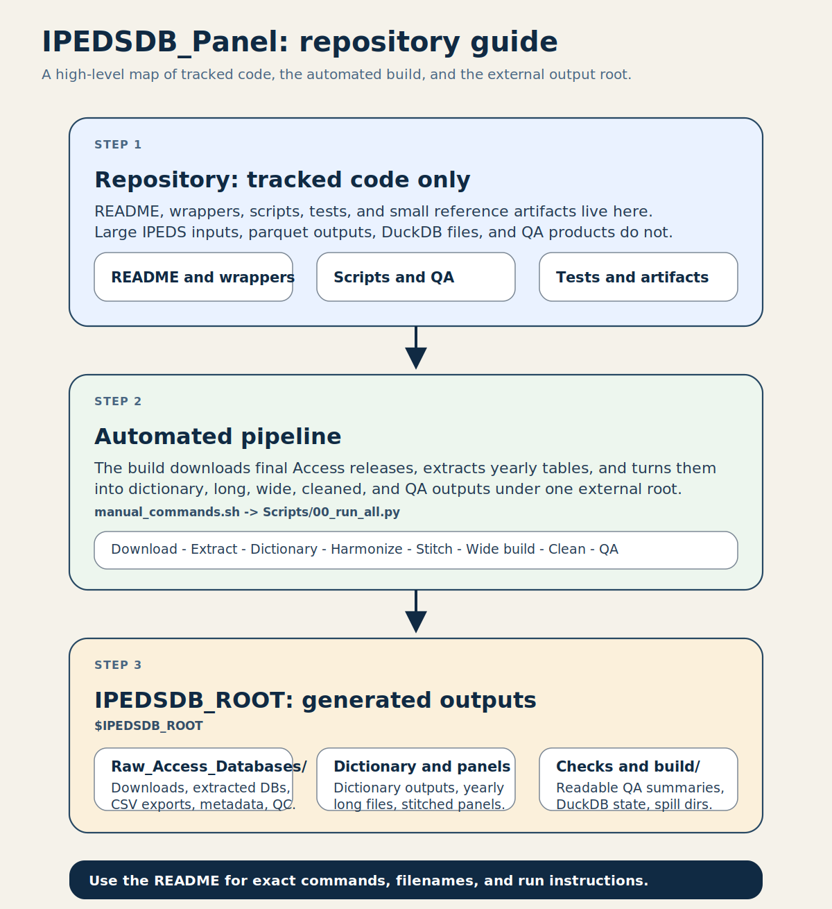
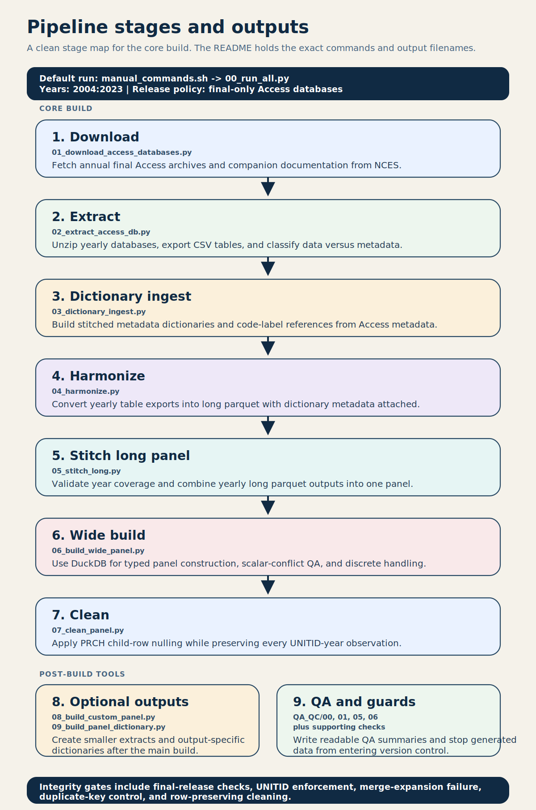
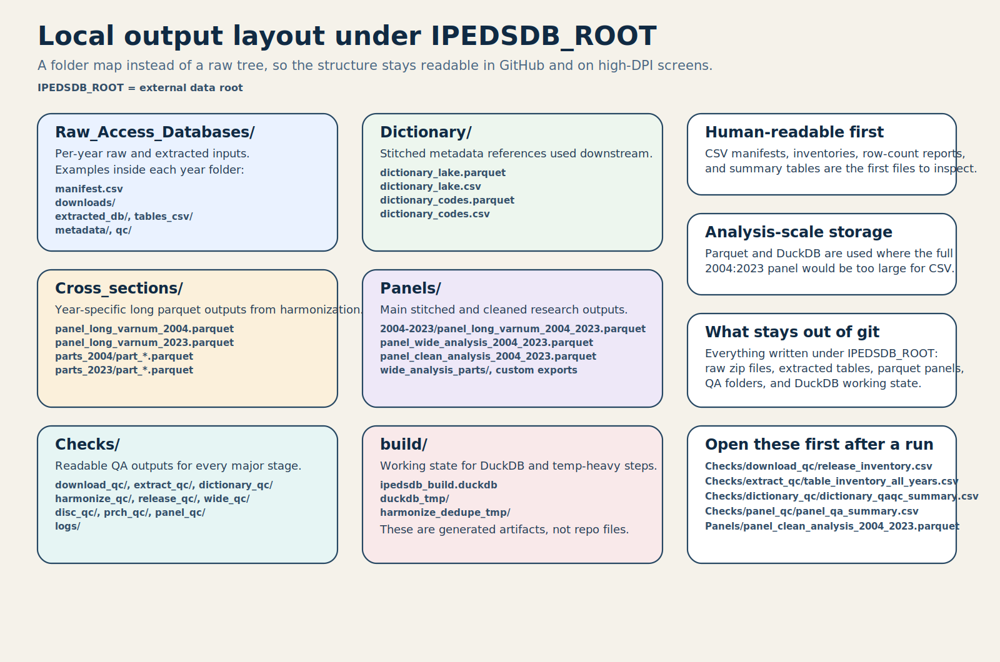

# IPEDSDB_Panel

Build a research-ready unbalanced IPEDS institution-year panel from NCES IPEDS Access databases.

This repository is code-first and data-outside-git by design:

- Unit of analysis: `UNITID` by `year`
- Default coverage in this repo: `2004:2023`
- Release policy: `Final` Access releases only
- Upstream input: annual IPEDS Access databases, not flat component files
- Canonical final output: `panel_clean_analysis_2004_2023.parquet`

## If You Are Trying To...

| Goal | Start here |
| --- | --- |
| Run the whole pipeline | `bash manual_commands.sh` |
| Test the setup without a long build | `python Scripts/00_run_all.py --years "2023:2023" --run-cleaning --run-qaqc` |
| Check whether an existing build looks healthy | `bash Scripts/QA_QC/qc_only.sh` |
| Run saved inspection SQL and export results | `python Scripts/run_saved_query.py --list` |
| Pull only a subset of variables | `python Scripts/08_build_custom_panel.py ...` |
| Understand where a file came from | open `Checks/`, then `Dictionary/`, then `Raw_Access_Databases/<year>/metadata/` |
| Inspect what the repo is doing | `manual_commands.sh` -> `Scripts/00_run_all.py` -> stage scripts in `Scripts/01-09` |

## At A Glance

| Item | Value |
| --- | --- |
| Repo path | `.../Documents/GitHub/IPEDSDB_Panel` |
| External data root | `.../Projects/IPEDSDB_Paneling` |
| Primary entrypoint | `bash manual_commands.sh` |
| SQL engine | DuckDB |
| Access extraction backend | `mdb-tools` |
| Main panel key | `UNITID`, `year` |

## Repository Guide



The repo holds scripts, tests, and small reference artifacts. All downloaded data, extracted tables, parquet outputs, QA reports, and DuckDB state are written automatically under `IPEDSDB_ROOT`.

## Pipeline Overview



The orchestration path is:

1. download final Access archives and companion documentation
2. extract one Access database per year and export tables to CSV
3. build metadata dictionaries from Access metadata tables
4. harmonize yearly long files keyed by `UNITID`, `year`, `varnumber`, `source_file`
5. stitch the long panel
6. build the wide analysis panel in DuckDB
7. apply PRCH cleaning
8. emit QA/QC artifacts and optional custom outputs

## Local Output Layout



The scripts create this structure automatically so the run stays inspectable after completion. CSV manifests and QA reports make the output human-readable; Parquet and DuckDB handle scale.

## What Lives Where

### In the repo

| Path | Purpose |
| --- | --- |
| `README.md` | operator guide |
| `manual_commands.sh` | one-command local run |
| `requirements.txt` | Python dependencies |
| `Scripts/` | pipeline stages and utilities |
| `Scripts/QA_QC/` | QA, parity, and repo guards |
| `Artifacts/` | small tracked reference files and guide figures |
| `Customize_Panel/selectedvars.txt` | starter variable list for custom extracts |
| `Queries/` | saved starter SQL for DuckDB inspection |
| `tests/` | lightweight parser and metadata tests |

### Outside the repo

Set:

```bash
export IPEDSDB_ROOT="/Users/markjaysonfarol13/Projects/IPEDSDB_Paneling"
```

If `IPEDSDB_ROOT` is unset, the scripts default to that same path.

Top-level folders created under `IPEDSDB_ROOT`:

- `Raw_Access_Databases/`
- `Dictionary/`
- `Cross_sections/`
- `Panels/`
- `Checks/`
- `build/`

## First-Run Checklist

Before running anything expensive, confirm these five items:

1. You are inside the repo: `.../Documents/GitHub/IPEDSDB_Panel`
2. The repo-local venv is active: `source .venv/bin/activate`
3. `IPEDSDB_ROOT` points to the external local folder you want to use
4. `mdb-tables`, `mdb-schema`, and `mdb-export` are available on `PATH`
5. You are comfortable with the pipeline downloading and writing large files under `IPEDSDB_ROOT`

## One-Time Setup

### 1. Create and activate a repo-local virtual environment

```bash
cd /Users/markjaysonfarol13/Documents/GitHub/IPEDSDB_Panel
python3 -m venv .venv
source .venv/bin/activate
```

### 2. Install Python dependencies

```bash
python -m pip install -r requirements.txt
```

### 3. Verify the Access extraction backend

```bash
which mdb-tables mdb-schema mdb-export
```

The extraction stage will stop immediately if any of those binaries are missing.

## Standard Run

### Full pipeline

```bash
cd /Users/markjaysonfarol13/Documents/GitHub/IPEDSDB_Panel
source .venv/bin/activate
export IPEDSDB_ROOT="/Users/markjaysonfarol13/Projects/IPEDSDB_Paneling"

bash manual_commands.sh
```

This wrapper:

- activates `.venv` if it exists
- checks `mdb-tools`
- creates `IPEDSDB_ROOT` if needed
- runs the full `2004:2023` build
- runs cleaning and QA

What to expect:

- the download stage writes one `manifest.csv` per year
- the extraction stage creates one CSV per Access table
- the dictionary and QA stages create many readable CSV summaries
- the largest final artifacts are parquet files in `Panels/`
- a full `2004:2023` run is materially heavier than a one-year smoke test

### Smoke test on a single year

```bash
cd /Users/markjaysonfarol13/Documents/GitHub/IPEDSDB_Panel
source .venv/bin/activate
export IPEDSDB_ROOT="/Users/markjaysonfarol13/Projects/IPEDSDB_Paneling"

python Scripts/00_run_all.py \
  --root "$IPEDSDB_ROOT" \
  --years "2023:2023" \
  --run-cleaning \
  --run-qaqc
```

### Dry run of the orchestration plan

```bash
python Scripts/00_run_all.py \
  --root "$IPEDSDB_ROOT" \
  --years "2004:2023" \
  --run-cleaning \
  --run-qaqc \
  --dry-run
```

## Main Outputs

After a full run, the main files to inspect are:

```text
$IPEDSDB_ROOT/Panels/2004-2023/panel_long_varnum_2004_2023.parquet
$IPEDSDB_ROOT/Panels/panel_wide_analysis_2004_2023.parquet
$IPEDSDB_ROOT/Panels/panel_clean_analysis_2004_2023.parquet
```

What each one means:

| File | Meaning |
| --- | --- |
| `panel_long_varnum_2004_2023.parquet` | stitched long panel at the variable-row level |
| `panel_wide_analysis_2004_2023.parquet` | wide analysis panel before PRCH cleaning |
| `panel_clean_analysis_2004_2023.parquet` | final cleaned analysis-ready panel |

Supporting outputs that are often useful during debugging:

```text
$IPEDSDB_ROOT/Dictionary/dictionary_lake.parquet
$IPEDSDB_ROOT/Dictionary/dictionary_codes.parquet
$IPEDSDB_ROOT/Checks/download_qc/release_inventory.csv
$IPEDSDB_ROOT/Checks/extract_qc/table_inventory_all_years.csv
$IPEDSDB_ROOT/Checks/dictionary_qc/dictionary_qaqc_summary.csv
$IPEDSDB_ROOT/Checks/panel_qc/panel_qa_summary.csv
```

If you want the fastest sanity check after a run, open these first:

1. `Checks/download_qc/release_inventory.csv`
2. `Checks/extract_qc/table_inventory_all_years.csv`
3. `Checks/dictionary_qc/dictionary_qaqc_summary.csv`
4. `Checks/panel_qc/panel_qa_summary.csv`
5. `Panels/panel_clean_analysis_2004_2023.parquet`

## DuckDB, Data Wrangler, And Saved SQL

The wide-build stage persists a DuckDB build database here:

```text
$IPEDSDB_ROOT/build/ipedsdb_build.duckdb
```

Use the saved-query runner when you want repeatable inspection results without editing file paths by hand.

List starter queries:

```bash
python Scripts/run_saved_query.py --list
```

Run one saved query:

```bash
python Scripts/run_saved_query.py 01_clean_panel_rows_by_year
```

What the query runner does:

- opens an in-memory DuckDB inspection session
- attaches the persisted build database when it exists
- exposes stable `inspect.*` views over the standard panel, dictionary, QA, and release-inventory artifacts
- writes a timestamped result folder under `Checks/query_results/`

Query-result folders contain:

- `result.csv` or `result.parquet`
- `query.sql`
- `query_run.json`
- `preview.txt`

If you use Data Wrangler, it is most useful on:

- `Checks/query_results/*/result.csv`
- QA CSV summaries in `Checks/`
- year-level metadata CSVs in `Raw_Access_Databases/<year>/metadata/`

It is less useful as the primary interface for the full raw all-years export footprint.

## Stage Map

| Stage | Script | What it does | Main outputs |
| --- | --- | --- | --- |
| Download | `Scripts/01_download_access_databases.py` | Scrapes the NCES Access page and downloads final-only yearly archives plus companion workbooks | `Raw_Access_Databases/<year>/manifest.csv`, `Checks/download_qc/` |
| Extract | `Scripts/02_extract_access_db.py` | Unzips the Access DB, exports each table to CSV, and classifies tables | `tables_csv/`, `metadata/table_inventory.csv`, `metadata/table_columns.csv` |
| Dictionary | `Scripts/03_dictionary_ingest.py` | Builds dictionary lake and code-label tables from Access metadata | `Dictionary/dictionary_lake.parquet`, `Dictionary/dictionary_codes.parquet` |
| Harmonize | `Scripts/04_harmonize.py` | Converts exported data tables into long parquet with metadata attached | `Cross_sections/panel_long_varnum_<year>.parquet`, `Checks/harmonize_qc/` |
| Stitch | `Scripts/05_stitch_long.py` | Combines yearly long outputs into one stitched panel | `Panels/2004-2023/panel_long_varnum_2004_2023.parquet` |
| Wide build | `Scripts/06_build_wide_panel.py` | Uses DuckDB to build the wide analysis panel and related QC | `Panels/panel_wide_analysis_2004_2023.parquet`, `Checks/wide_qc/`, `Checks/disc_qc/` |
| Clean | `Scripts/07_clean_panel.py` | Applies PRCH child-row cleaning while preserving all `UNITID-year` rows | `Panels/panel_clean_analysis_2004_2023.parquet`, `Checks/prch_qc/` |
| Custom extract | `Scripts/08_build_custom_panel.py` | Creates a smaller panel with selected columns | custom `.parquet` or `.csv` |
| Panel dictionary | `Scripts/09_build_panel_dictionary.py` | Builds a dictionary tied to actual wide-panel columns | panel-level dictionary `.csv` |

## Human-Readable QA/QC

The pipeline writes many CSV reports specifically so the local folder remains readable without opening parquet immediately.

Most useful QA directories:

| Directory | What to inspect first |
| --- | --- |
| `Checks/download_qc/` | `release_inventory.csv`, `missing_years.csv`, `download_failures.csv` |
| `Checks/extract_qc/` | `table_inventory_all_years.csv`, `extract_failures.csv` |
| `Checks/dictionary_qc/` | `dictionary_qaqc_summary.csv`, `dictionary_duplicates.csv`, `source_file_conflicts.csv` |
| `Checks/harmonize_qc/` | yearly `harmonize_summary_*.csv`, dropped `UNITID` reports |
| `Checks/release_qc/` | yearly release summaries confirming `final` |
| `Checks/wide_qc/` | scalar-conflict and wide-build reports |
| `Checks/prch_qc/` | `prch_clean_summary.csv`, `prch_clean_columns.csv` |
| `Checks/panel_qc/` | `panel_qa_summary.csv` |
| `Checks/query_results/` | saved-query outputs for inspection and Data Wrangler |
| `Checks/real_parity_runs/summary/` | cross-run task-monitor CSV and Markdown summaries |

Run QA only against existing outputs:

```bash
bash Scripts/QA_QC/qc_only.sh
```

## What A Healthy Run Looks Like

| Signal | What you want to see |
| --- | --- |
| Release coverage | requested years exist and are marked `Final` |
| Extraction | one Access DB per year and a non-empty `table_inventory.csv` |
| Dictionary | low or zero duplicate/conflict counts in `dictionary_qaqc_summary.csv` |
| Harmonization | no fatal `UNITID` issues and expected yearly summaries |
| Wide build | `panel_wide_analysis_2004_2023.parquet` exists and QA files are written |
| Final clean panel | `panel_clean_analysis_2004_2023.parquet` exists and `panel_qa_summary.csv` shows row preservation |

## When Something Breaks

Check these in order:

1. terminal output from the failing script
2. `Checks/download_qc/download_failures.csv`
3. `Checks/extract_qc/extract_failures.csv`
4. `Checks/dictionary_qc/dictionary_qaqc_summary.csv`
5. `Checks/harmonize_qc/`
6. `Checks/wide_qc/`
7. `Checks/panel_qc/panel_qa_summary.csv`

Common failure patterns:

| Problem | Likely place to look |
| --- | --- |
| download failed | network access, NCES page changes, `download_failures.csv` |
| extraction failed | `mdb-tools`, malformed zip, `extract_failures.csv` |
| missing metadata roles | yearly `metadata/table_inventory.csv` |
| missing `UNITID` fatal error | exported CSV table in `Raw_Access_Databases/<year>/tables_csv/` |
| weird wide-panel behavior | `Checks/wide_qc/`, `Checks/disc_qc/`, dictionary mapping |

## Common Follow-Up Commands

### Build a custom panel

```bash
python Scripts/08_build_custom_panel.py \
  --input "$IPEDSDB_ROOT/Panels/panel_clean_analysis_2004_2023.parquet" \
  --output "$IPEDSDB_ROOT/Panels/custom_panel_2004_2023.parquet" \
  --vars-file "Customize_Panel/selectedvars.txt" \
  --years "2004:2023"
```

### Export a panel dictionary for the cleaned panel

```bash
python Scripts/09_build_panel_dictionary.py \
  --input "$IPEDSDB_ROOT/Panels/panel_clean_analysis_2004_2023.parquet" \
  --dictionary "$IPEDSDB_ROOT/Dictionary/dictionary_lake.parquet" \
  --output "$IPEDSDB_ROOT/Panels/panel_clean_analysis_2004_2023_dictionary.csv"
```

### Run the repo guards

```bash
python Scripts/QA_QC/05_repo_size_guard.py
python Scripts/QA_QC/06_staged_repo_guard.py
```

### Run tests

```bash
python -m pytest -q
```

### Run a monitored wide build and refresh task-monitor summaries

```bash
python Scripts/QA_QC/03_monitored_analysis_build.py \
  --input "$IPEDSDB_ROOT/Panels/2004-2023/panel_long_varnum_2004_2023.parquet" \
  --dictionary "$IPEDSDB_ROOT/Dictionary/dictionary_lake.parquet"
```

That workflow now refreshes:

```text
$IPEDSDB_ROOT/Checks/real_parity_runs/summary/task_monitor_summary.csv
$IPEDSDB_ROOT/Checks/real_parity_runs/summary/task_monitor_summary.md
```

## Glossary

| Term | Meaning in this repo |
| --- | --- |
| Access DB | the yearly NCES IPEDS Microsoft Access database |
| Dictionary lake | the stitched metadata reference built from Access metadata tables |
| Long panel | one row per `UNITID-year-variable` style observation |
| Wide panel | one row per `UNITID-year` with variables as columns |
| PRCH cleaning | parent-child handling that nulls affected component-family columns without dropping rows |
| `source_file` | normalized survey-family label used across harmonization and wide build |
| smoke test | a small run, typically one year, used to verify setup before a full build |

## Guardrails And Assumptions

- This repo is currently configured around `2004:2023`.
- The workflow is `Final` release only. Provisional releases are intentionally excluded from the default build.
- `UNITID` and `year` are treated as the panel keys.
- Access extraction uses `mdb-tools`; there is no silent fallback backend.
- Generated data should not be committed to git.
- No script in this repo performs a git commit or push.

## Practical Reading Order

If you are new to the repo, this order is usually fastest:

1. `README.md`
2. `manual_commands.sh`
3. `Scripts/00_run_all.py`
4. `Scripts/01_download_access_databases.py`
5. `Scripts/02_extract_access_db.py`
6. `Scripts/03_dictionary_ingest.py`
7. `Scripts/04_harmonize.py`
8. `Scripts/06_build_wide_panel.py`

That path mirrors the actual data flow and gets you from acquisition to the final cleaned panel with the least context switching.
