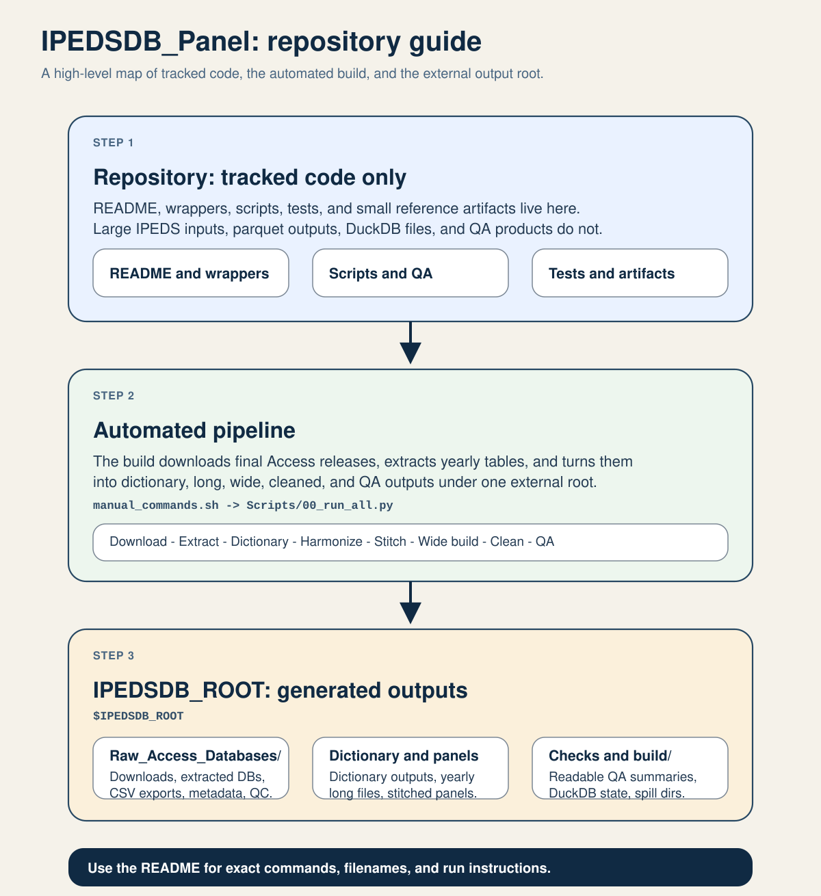
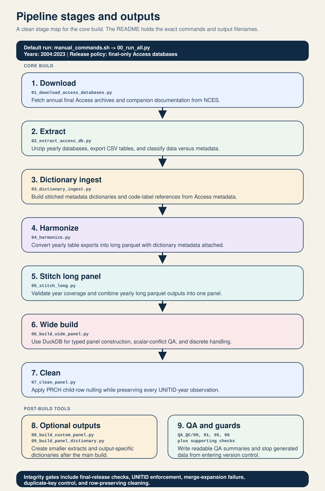

# IPEDSDB_Panel

Build an unbalanced IPEDS institution-year panel from NCES IPEDS Access databases.

This repo converts annual IPEDS Access databases into one institution-by-year panel and writes QA files that document each release decision.

If you are new to the repo, start with this:

- the repo holds the code, docs, and small tracked artifacts
- `IPEDSDB_ROOT` holds the real downloads, outputs, and QA files
- `Final/` contains the current panel and its matching metadata
- `bash manual_commands.sh` starts a new build under `Work/`
- `Releases/` retains complete versioned releases and their evidence

This repository is code-first and data-outside-git by design:

- Unit of analysis: `UNITID` by `year`
- Default coverage in this repo: `2004:2023`
- Release policy: `Final` Access releases only
- Upstream input: annual IPEDS Access databases, not flat component files
- Current final output: `Final/panel_clean_prch_2004_2023.parquet`

## Quickstart

Open your `IPEDSDB_Panel` repository and use the CIRAGO data root:

```bash
cd /path/to/IPEDSDB_Panel
source .venv/bin/activate
export IPEDSDB_ROOT="/Volumes/CIRAGO/IPEDSDB_PANEL"
```

Open `$IPEDSDB_ROOT/Final/panel_clean_prch_2004_2023.parquet` for the full
2004-2023 panel: 141,711 institution-year rows and 2,721 columns. Its matching
variable definitions and codebooks are in `Final/Metadata/`, and its source
lineage is `Final/value_lineage.parquet`. `Final/manifest.json` records their
current paths and checksums.

`Final/SFA_2023_exports/` contains the validated 2023 SFA subset in Stata, CSV,
Excel, and Parquet: 6,163 rows and 345 columns, including the two panel keys.
Use the full Parquet panel when working beyond that subset, and export the
variables and years you need with Stage 08.

The current release is `2023-sfa-v1`. The marker `layout.json` selects it;
`Final` links to its unchanged files under `Releases/2023-sfa-v1/`. Future builds
write to `Work` and do not replace `Final` automatically.

## Common tasks

| Goal | Start here |
| --- | --- |
| Open the current full dataset | `$IPEDSDB_ROOT/Final/panel_clean_prch_2004_2023.parquet` |
| Open the validated 2023 SFA exports | `$IPEDSDB_ROOT/Final/SFA_2023_exports/` |
| Run the whole pipeline | `bash manual_commands.sh` |
| Test the setup without a full historical build | `python Scripts/00_run_all.py --years "2022:2023" --run-cleaning --run-qaqc` |
| Check whether an existing build passes QA | `bash Scripts/QA_QC/qc_only.sh` |
| Run the final acceptance audit only | `python Scripts/QA_QC/08_acceptance_audit.py --root "$IPEDSDB_ROOT" --years "2004:2023"` |
| Freeze public-release checksums | `python Scripts/QA_QC/12_build_release_manifest.py --root "$IPEDSDB_ROOT" --years "2004:2023"` |
| Run the public-release gate | `bash Scripts/QA_QC/release_gate.sh` |
| Record the build environment | `python Scripts/QA_QC/20_environment_report.py --root "$IPEDSDB_ROOT"` |
| Build join-risk outputs | `python Scripts/QA_QC/22_build_entity_continuity_crosswalk.py --root "$IPEDSDB_ROOT"` |
| Run saved inspection SQL and export results | `python Scripts/run_saved_query.py --list` |
| Browse variables present in the current panel | `python Scripts/10_build_variable_browser.py ...` |
| Pull only a subset of variables | `python Scripts/08_build_custom_panel.py ...` |
| Understand the current dataset's sources | open `Final/manifest.json`, `Final/Metadata/`, and the evidence in `Releases/2023-sfa-v1/` |
| Inspect what the repo is doing | `manual_commands.sh` -> `Scripts/00_run_all.py` -> stage scripts in `Scripts/01-09` |

## At a glance

| Item | Value |
| --- | --- |
| Repo path | local `IPEDSDB_Panel` clone |
| External data root | `$IPEDSDB_ROOT` |
| Primary entrypoint | `bash manual_commands.sh` |
| SQL engine | DuckDB |
| Access extraction backend | `mdb-tools` |
| Main panel key | `UNITID`, `year` |

## Build model

The organized data root separates everyday analysis from build products:

| Folder | Purpose |
| --- | --- |
| `Final/` | current full panel, matched metadata, lineage, and validated SFA exports |
| `Releases/2023-sfa-v1/` | complete immutable corrected release with verification evidence |
| `Sources/Raw_Access_Databases/` | original downloaded releases and extracted source tables |
| `Work/` | new dictionaries, intermediate tables, panels, QA, and build state |
| `Archive/pre_metadata_repair/` | retained pre-repair panels, dictionaries, QA, and build files |

Use `Final` for current analysis. Use `manual_commands.sh` for a future build
and inspect its outputs in `Work/Checks`. The archive preserves the earlier
folder relationships so its relative links continue to resolve.

## Release status

The current corrected release is `2023-sfa-v1`, described in the
[repair and validation report](docs/2023_SFA_METADATA_REPAIR.md).

- Full clean panel: 141,711 rows, 2,721 columns, years 2004-2023.
- Corrected dictionary: 66,746 rows; category codebook: 208,339 rows.
- All 343 affected SFA definitions retain original metadata and verified physical-table corrections.
- Full wide and clean panel values, schemas, and missingness equal the pre-repair baseline.
- All 150,801,591 value-lineage rows and 286,180 PRCH actions remain unchanged.
- The 2023 SFA subset passed exact Parquet, CSV, Stata, and Excel readback; native Stata verified its values and labels.

These results belong to the immutable release. A later build under `Work`
needs its own validation before it can become the current release. Measurement
semantics absent from the source remain explicitly unknown.

## Public release checklist

The repository is prepared for a public release when these checks pass from the repo root:

```bash
PYTEST_DISABLE_PLUGIN_AUTOLOAD=1 python3 -m pytest -q
python3 Scripts/QA_QC/11_validate_panel_contract.py
python3 Scripts/QA_QC/18_public_release_guard.py
python3 Scripts/QA_QC/19_docs_style_guard.py
bash Scripts/QA_QC/release_gate.sh
```

The full release gate expects a populated build workspace under `IPEDSDB_ROOT/Work`. It validates the panel contract, public-facing repository files, documentation style, acceptance audit, release manifest, checksum verification, Data Package metadata, build provenance, public bundle, repo size, staged-file policy, and tests. It does not promote a new current release automatically.

For archive work, set `REQUIRE_EXTERNAL_BENCHMARKS=1` after `contracts/external_benchmarks.csv` has been filled with official benchmark rows. Without that flag, the benchmark script writes a review artifact when no external benchmarks are configured.

Public deposits should include:

- the release bundle under `Releases/ipedsdb_panel_2004_2023/`
- `SHA256SUMS.txt`
- `CITATION.cff`
- `datacite.json`
- `ro-crate-metadata.json`
- `metadata/release_manifest.csv`
- `metadata/release_manifest_verification.csv`
- `metadata/environment_report.json`
- `metadata/entity_continuity/entity_continuity_crosswalk.csv`
- `metadata/external_benchmarks/external_benchmark_reconciliation.csv`

## License and reuse

Mark Jayson Farol is the sole researcher, maintainer, and code owner for this repository.

Current contact information is available at `https://markjayson.com`.

Repository code is released under the MIT License in `LICENSE`. Derived release data, QA tables, manifests, and metadata produced by this repository are released under CC BY 4.0 as described in `DATA_LICENSE.md`.

The upstream source is NCES IPEDS public data. This repository does not relicense NCES material. Cite NCES/IPEDS for the source data and cite IPEDSDB_Panel for the panel construction, cleaning policy, manifests, and QA evidence.

## Acknowledgments

This project acknowledges Professor Djeto Assane, Ph.D., Department of Economics, University of Nevada, Las Vegas, as Mark Jayson Farol's research mentor. See `ACKNOWLEDGMENTS.md` for public profile links.

## Core references

These references shape the repo's construction logic, QA design, and interpretation cautions. Most users do not need them on a first read.

If you want the repo's applied version, start with:

- `METHODS_PANEL_CONSTRUCTION.md`
- `METHODS_PRCH_CLEANING.md`

<details>
<summary>See the full reference list</summary>

- Jaquette, O., & Parra, E. E. (2014). *Using IPEDS for Panel Analyses: Core Concepts, Data Challenges, and Empirical Applications.* In M. B. Paulsen (Ed.), *Higher Education: Handbook of Theory and Research* (Vol. 29, pp. 467-533). Springer. https://doi.org/10.1007/978-94-017-8005-6_11
- Kelchen, R. (2019). *Merging Data to Facilitate Analyses.* *New Directions for Institutional Research*, 2019. https://doi.org/10.1002/ir.20298
- Jaquette, O., & Parra, E. (2016). *The Problem with the Delta Cost Project Database.* *Research in Higher Education*, 57(5), 630-651. https://doi.org/10.1007/s11162-015-9399-2
- Cheslock, J. J., & Shamekhi, Y. (2020). *Decomposing financial inequality across U.S. higher education institutions.* *Economics of Education Review*, 78, 102035. https://doi.org/10.1016/j.econedurev.2020.102035
- Wooldridge, J. M. (2010). *Econometric Analysis of Cross Section and Panel Data* (2nd ed.). MIT Press.
- Wooldridge, J. M. (2019). *Correlated random effects models with unbalanced panels.* *Journal of Econometrics*, 211(1), 137-150. https://doi.org/10.1016/j.jeconom.2018.12.010
- Baltagi, B. H. (2021). *Econometric Analysis of Panel Data* (6th ed.). Springer. https://doi.org/10.1007/978-3-030-53953-5
- NCES. *IPEDS Access Databases.* https://nces.ed.gov/ipeds/use-the-data/download-access-database
- NCES. *Survey Components.* https://nces.ed.gov/ipeds/survey-components
- NCES. *Data Literacy/Data Use Training (DLDT).* https://nces.ed.gov/ipeds/use-the-data/dldt
- NCES. *Institutional Groupings.* https://nces.ed.gov/ipeds/about-ipeds-data/institutional-groupings
- NCES. *Reporting Finance Data for Multiple Institutions.* https://nces.ed.gov/ipeds/report-your-data/data-tip-sheet-reporting-finance-data-multiple-institutions

</details>

## Repository guide



Think of the split this way:

- the repo holds code, tests, notes, and small tracked reference files
- `IPEDSDB_ROOT` holds the real working data: downloads, extracted tables, parquet panels, QA summaries, and DuckDB build state

That keeps the git repo readable while still leaving a full local audit trail behind each run.

## Pipeline overview



The orchestration path is:

1. download final Access archives and companion documentation
2. extract one Access database per year and export tables to CSV
3. build metadata dictionaries from Access metadata tables
4. harmonize yearly long files keyed by `UNITID`, `year`, `varnumber`, `source_file`
5. stitch the long panel
6. build the wide analysis panel in DuckDB
7. apply PRCH cleaning
8. emit QA/QC artifacts and optional custom outputs

## Local output layout

The organized CIRAGO root uses this layout:

```text
IPEDSDB_PANEL/
  layout.json
  Final/
    panel_clean_prch_2004_2023.parquet
    Metadata/
    value_lineage.parquet
    SFA_2023_exports/
    manifest.json
  Releases/2023-sfa-v1/
  Sources/Raw_Access_Databases/
  Work/{Panels,Dictionary,Checks,Cross_sections,build}/
  Archive/pre_metadata_repair/
```

To inspect or migrate an existing flat root, preview the exact planned moves:

```bash
python Scripts/organize_data_root.py --root "$IPEDSDB_ROOT"
```

Apply that plan with `--apply`. The organization changes paths, preserves the
release bytes and historical receipts, and writes current-path information in
`Final/manifest.json`.

## First files to open

For a short review, open these five files first:

1. `README.md`
2. `Scripts/README.md`
3. `Scripts/00_run_all.py`
4. `$IPEDSDB_ROOT/Final/manifest.json`
5. `$IPEDSDB_ROOT/Final/panel_clean_prch_2004_2023.parquet`

## What lives where

### In the repo

| Path | Purpose |
| --- | --- |
| `README.md` | operator guide |
| `CONTACT.md` | public maintainer contact point |
| `ACKNOWLEDGMENTS.md` | research mentor acknowledgment and profile links |
| `LICENSE` and `DATA_LICENSE.md` | code and data reuse terms |
| `CONTRIBUTING.md`, `SECURITY.md`, `GOVERNANCE.md`, `CHANGELOG.md` | public repository policy |
| `Dockerfile` and `requirements-lock.txt` | cold-machine build environment |
| `MIGRATION.md` | predecessor-to-current migration notes |
| `manual_commands.sh` | one-command local run |
| `requirements.txt` | Python dependencies |
| `Scripts/` | pipeline stages and utilities |
| `Scripts/QA_QC/` | QA, parity, and repo guards |
| `contracts/` | versioned declarations of the canonical panel contract |
| `Artifacts/` | small tracked reference files and guide figures |
| `Customize_Panel/selectedvars.txt` | starter variable list for custom extracts |
| `docs/` | GitHub Pages publish directory for the public variable-browser snapshot, landing page, and user guide |
| `Queries/` | saved starter SQL for DuckDB inspection |
| `tests/` | lightweight parser and metadata tests |

### Outside the repo

Set:

```bash
export IPEDSDB_ROOT="/Volumes/CIRAGO/IPEDSDB_PANEL"
```

The default data root is `/Volumes/CIRAGO/IPEDSDB_PANEL`. Set `IPEDSDB_ROOT`
explicitly when selecting a different drive or a separate build root.

The organized root is identified by `layout.json` with `schema_version: 1` and
`current_release: "2023-sfa-v1"`. Pipeline stages use `Sources` for original
inputs and `Work` for new outputs. Analyst tools use the current release through
`Final`. Unmarked roots retain the legacy flat layout for reproducible older
builds; the paths in this guide describe the marked CIRAGO layout.

## First-run checklist

Before starting a long build, check these five things:

1. You are inside the repo: `IPEDSDB_Panel`
2. The repo-local venv is active: `source .venv/bin/activate`
3. `IPEDSDB_ROOT` points to the external local folder you want to use
4. `mdb-tables`, `mdb-schema`, and `mdb-export` are available on `PATH`
5. You are comfortable with the pipeline downloading and writing large files under `IPEDSDB_ROOT`

If you are unsure whether your environment is ready, run the smallest QA check:

```bash
bash Scripts/QA_QC/qc_only.sh
```

That checks a populated future build in `Work`; it is not a prerequisite for opening the already verified panel in `Final`.

## One-time setup

### 1. Create and activate a repo-local virtual environment

```bash
cd /path/to/IPEDSDB_Panel
python3 -m venv .venv
source .venv/bin/activate
```

### 2. Install Python dependencies

```bash
python -m pip install -r requirements.txt
```

### 3. Verify the Access extraction backend

```bash
which mdb-tables mdb-schema mdb-export
```

The extraction stage will stop immediately if any of those binaries are missing.

## Standard run

### Full pipeline

```bash
cd /path/to/IPEDSDB_Panel
source .venv/bin/activate
export IPEDSDB_ROOT="/Volumes/CIRAGO/IPEDSDB_PANEL"

bash manual_commands.sh
```

This wrapper is the normal “just run the whole thing” path. It:

- activates `.venv` if it exists
- checks `mdb-tools`
- creates `IPEDSDB_ROOT` if needed
- runs the full `2004:2023` build
- runs cleaning and QA

What to expect from a full run:

- the download stage writes one `manifest.csv` per year
- the extraction stage creates one CSV per Access table
- the dictionary and QA stages create many readable CSV summaries
- the largest final artifacts are parquet files in `Work/Panels/`
- a full `2004:2023` run is materially heavier than a one-year smoke test

If you are wondering whether the build is “stuck,” the best places to look are:

- the current terminal output
- `Work/Checks/logs/`
- the newest files appearing under the active year in `Sources/Raw_Access_Databases/`
- the newest summary CSV written under `Work/Checks/`

### Smoke test with cleaning and QA

Use at least two years if you want Stage 07 cleaning and panel QA. The cleaner intentionally refuses a single-year input because the cleaned release product is meant to be a true panel, not a one-year slice.

```bash
cd /path/to/IPEDSDB_Panel
source .venv/bin/activate
export IPEDSDB_ROOT="/Volumes/CIRAGO/IPEDSDB_PANEL"

python Scripts/00_run_all.py \
  --root "$IPEDSDB_ROOT" \
  --years "2022:2023" \
  --run-cleaning \
  --run-qaqc
```

### Single-year smoke test without cleaning

If you only want to validate acquisition through wide-build on a single year, skip the cleaning layer:

```bash
python Scripts/00_run_all.py \
  --root "$IPEDSDB_ROOT" \
  --years "2023:2023"
```

### Dry run of the orchestration plan

```bash
python Scripts/00_run_all.py \
  --root "$IPEDSDB_ROOT" \
  --years "2004:2023" \
  --run-cleaning \
  --run-qaqc \
  --dry-run
```

## Main outputs

The current analysis file is:

```text
$IPEDSDB_ROOT/Final/panel_clean_prch_2004_2023.parquet
```

Keep it paired with `Final/Metadata` and `Final/value_lineage.parquet`.
The full release, including its long panel and evidence, is retained under
`Releases/2023-sfa-v1`. The SFA exports in `Final/SFA_2023_exports` are a subset.

After a future run of the main pipeline, inspect its separate build outputs:

```text
$IPEDSDB_ROOT/Work/Panels/2004-2023/panel_long_varnum_2004_2023.parquet
$IPEDSDB_ROOT/Work/Panels/panel_wide_analysis_2004_2023.parquet
$IPEDSDB_ROOT/Work/Panels/panel_clean_analysis_2004_2023.parquet
```

What each one means:

| File | Meaning |
| --- | --- |
| `panel_long_varnum_2004_2023.parquet` | stitched long panel at the variable-row level |
| `panel_wide_analysis_2004_2023.parquet` | wide analysis panel before PRCH cleaning |
| `panel_clean_analysis_2004_2023.parquet` | cleaned build output awaiting release validation |

Supporting outputs that are often useful during debugging:

```text
$IPEDSDB_ROOT/Work/Dictionary/dictionary_lake.parquet
$IPEDSDB_ROOT/Work/Dictionary/dictionary_codes.parquet
$IPEDSDB_ROOT/Work/Checks/download_qc/release_inventory.csv
$IPEDSDB_ROOT/Work/Checks/extract_qc/table_inventory_all_years.csv
$IPEDSDB_ROOT/Work/Checks/dictionary_qc/dictionary_qaqc_summary.csv
$IPEDSDB_ROOT/Work/Checks/panel_qc/panel_qa_summary.csv
$IPEDSDB_ROOT/Work/Checks/panel_qc/panel_qa_coverage_matrix.csv
$IPEDSDB_ROOT/Work/Checks/acceptance_qc/acceptance_summary.csv
```

For a run-level sanity check, open these first in order:

1. `Work/Checks/download_qc/release_inventory.csv`
2. `Work/Checks/extract_qc/table_inventory_all_years.csv`
3. `Work/Checks/dictionary_qc/dictionary_qaqc_summary.csv`
4. `Work/Checks/panel_qc/panel_qa_coverage_matrix.csv`
5. `Work/Checks/acceptance_qc/acceptance_summary.md`
6. `Work/Panels/panel_clean_analysis_2004_2023.parquet`

## DuckDB, Data Wrangler, and saved SQL

The wide-build stage persists a DuckDB build database here:

```text
$IPEDSDB_ROOT/Work/build/ipedsdb_build.duckdb
```

Use the saved-query runner for repeatable inspection results. In the organized layout its panel and dictionary views use the matched current release; optional build state and new query outputs stay in `Work`.

List starter queries:

```bash
python Scripts/run_saved_query.py --list
```

Run one saved query:

```bash
python Scripts/run_saved_query.py 01_clean_panel_rows_by_year
```

What the query runner does:

- opens an in-memory DuckDB inspection session
- attaches the persisted build database when it exists
- exposes stable `inspect.*` views over the standard panel, dictionary, QA, and release-inventory artifacts
- writes a timestamped result folder under `Work/Checks/query_results/`

Query-result folders contain:

- `result.csv` or `result.parquet`
- `query.sql`
- `query_run.json`
- `preview.txt`

If you use Data Wrangler, it is most useful on:

- `Work/Checks/query_results/*/result.csv`
- QA CSV summaries in `Work/Checks/`
- year-level metadata CSVs in `Sources/Raw_Access_Databases/<year>/metadata/`

It is not the main execution interface for this repo. Think of it as a convenience layer for inspection, not the source of truth for the build.

Repeatable inspection order:

1. run saved SQL with `run_saved_query.py`
2. open the exported `result.csv`
3. use Data Wrangler on that CSV instead of pointing it at the full build directly

## Stage map

| Stage | Script | What it does | Main outputs |
| --- | --- | --- | --- |
| Download | `Scripts/01_download_access_databases.py` | Scrapes the NCES Access page and downloads final-only yearly archives plus companion workbooks | `Sources/Raw_Access_Databases/<year>/manifest.csv`, `Work/Checks/download_qc/` |
| Extract | `Scripts/02_extract_access_db.py` | Unzips the Access DB, exports each table to CSV, and classifies tables | `tables_csv/`, `metadata/table_inventory.csv`, `metadata/table_columns.csv` |
| Dictionary | `Scripts/03_dictionary_ingest.py` | Builds dictionary lake and code-label tables from Access metadata | `Work/Dictionary/dictionary_lake.parquet`, `Work/Dictionary/dictionary_codes.parquet` |
| Harmonize | `Scripts/04_harmonize.py` | Converts exported data tables into long parquet with metadata attached, failing on ambiguous dictionary mappings unless documented in `contracts/dictionary_ambiguity_overrides.csv` | `Work/Cross_sections/panel_long_varnum_<year>.parquet`, `Work/Checks/harmonize_qc/` |
| Stitch | `Scripts/05_stitch_long.py` | Combines yearly long outputs into one stitched panel | `Work/Panels/2004-2023/panel_long_varnum_2004_2023.parquet` |
| Wide build | `Scripts/06_build_wide_panel.py` | Uses DuckDB to build the wide analysis panel and related QC | `Work/Panels/panel_wide_analysis_2004_2023.parquet`, `Work/Checks/wide_qc/`, `Work/Checks/disc_qc/` |
| Clean | `Scripts/07_clean_panel.py` | Applies PRCH child-row cleaning while preserving all `UNITID-year` rows | `Work/Panels/panel_clean_analysis_2004_2023.parquet`, `Work/Checks/prch_qc/` |
| Custom extract | `Scripts/08_build_custom_panel.py` | Creates a smaller panel with selected columns, labels, and metadata | `.parquet`, `.csv`, `.dta`, or `.xlsx` plus companions |
| Panel dictionary | `Scripts/09_build_panel_dictionary.py` | Builds a dictionary tied to actual wide-panel columns | panel-level dictionary `.csv` or `.xlsx` |

## Human-readable QA/QC

The pipeline writes a lot of CSV on purpose. The goal is that you can answer “what happened?” by opening a few readable summaries instead of jumping straight into parquet inspection.

The practical reading order is:

1. `acceptance_qc/` for the top-level pass/fail decision
2. `panel_qc/` for row-preservation and PRCH behavior
3. `dictionary_qc/` for metadata and source-family issues
4. `wide_qc/` or `harmonize_qc/` only if one of the higher-level summaries points there

Most useful QA directories:

| Directory | What to inspect first |
| --- | --- |
| `Work/Checks/download_qc/` | `release_inventory.csv`, `missing_years.csv`, `download_failures.csv` |
| `Work/Checks/extract_qc/` | `table_inventory_all_years.csv`, `extract_failures.csv` |
| `Work/Checks/dictionary_qc/` | `dictionary_qaqc_summary.csv`, `unmapped_metadata_tables.csv`, `noncanonical_source_categories.csv` |
| `Work/Checks/harmonize_qc/` | yearly `harmonize_summary_*.csv`, dropped `UNITID` reports |
| `Work/Checks/release_qc/` | yearly release summaries confirming `final` |
| `Work/Checks/wide_qc/` | scalar-conflict and wide-build reports |
| `Work/Checks/disc_qc/` | `disc_conflicts_summary_all_years.csv` first, then year-level detail only if needed |
| `Work/Checks/prch_qc/` | `prch_clean_summary.csv`, `prch_clean_columns.csv`, `prch_flag_policy.csv` |
| `Work/Checks/panel_qc/` | `panel_qa_summary.csv`, `panel_qa_coverage_matrix.csv`, `panel_structure_summary.csv`, `identifier_linkage_summary.csv`, `classification_stability_summary.csv` |
| `Work/Checks/acceptance_qc/` | `acceptance_summary.csv`, `acceptance_summary.md` |
| `Work/Checks/query_results/` | saved-query outputs for inspection and Data Wrangler |
| `Work/Checks/real_parity_runs/summary/` | cross-run task-monitor CSV and Markdown summaries |

Run QA only against existing outputs:

```bash
bash Scripts/QA_QC/qc_only.sh
```

That wrapper now runs:

- `00_dictionary_qaqc.py`
- `01_panel_qa.py`
- `09_panel_structure_qc.py`
- `08_acceptance_audit.py`

## Acceptance audit

The acceptance audit is the final “is this build release-ready?” check over the live generated artifacts under `IPEDSDB_ROOT`.

Run it directly:

```bash
python Scripts/QA_QC/08_acceptance_audit.py \
  --root "$IPEDSDB_ROOT" \
  --years "2004:2023"
```

It writes:

```text
$IPEDSDB_ROOT/Work/Checks/acceptance_qc/acceptance_summary.csv
$IPEDSDB_ROOT/Work/Checks/acceptance_qc/acceptance_summary.md
```

It checks:

- required panel, dictionary, and QA artifacts exist
- exact `2004:2023` year coverage
- no duplicate `(UNITID, year)` keys in wide or clean outputs
- long-panel key fields are non-null and non-blank
- raw and clean row counts match
- dictionary QA has no unresolved duplicate/conflict/unmapped rows
- panel QA has no suspicious PRCH flags
- discrete-conflict QA has no remaining high-signal groups

## PRCH cleaning method

The authoritative method note for parent-child cleaning is:

- `METHODS_PRCH_CLEANING.md`

The authoritative full-construction method note is:

- `METHODS_PANEL_CONSTRUCTION.md`

Current repo policy is intentionally component-specific:

- keep every `UNITID-year` row
- null only the component-family columns affected by a `PRCH_*` flag
- for Finance, clean `PRCH_F` codes `2,3,4,5`
- retain `PRCH_F=6` as a review-only partial case because blanket nulling would erase valid reported finance values

The cleaned panel is row-preserving, not institution-collapsing.

## Expected run signals

| Signal | What you want to see |
| --- | --- |
| Release coverage | requested years exist and are marked `Final` |
| Extraction | one Access DB per year and a non-empty `table_inventory.csv` |
| Dictionary | low duplicate/conflict counts and a mostly categorized noncanonical source report |
| Harmonization | no fatal `UNITID` issues and expected yearly summaries |
| Wide build | `panel_wide_analysis_2004_2023.parquet` exists and QA files are written |
| Final clean panel | `panel_clean_analysis_2004_2023.parquet` exists, `panel_qa_summary.csv` shows row preservation, and `panel_qa_coverage_matrix.csv` has no unexplained `suspicious` flags |
| Acceptance audit | `Work/Checks/acceptance_qc/acceptance_summary.csv` is all `PASS` |

You should not need to open every QA directory when a run passes the top-level checks. In the normal case, `acceptance_qc/` and `panel_qc/` are enough to decide whether deeper inspection is necessary.

For structure-sensitive work, the most informative new files are:

- `Work/Checks/panel_qc/panel_structure_summary.csv`
- `Work/Checks/panel_qc/entry_exit_gap_summary.csv`
- `Work/Checks/panel_qc/identifier_linkage_summary.csv`
- `Work/Checks/panel_qc/classification_stability_summary.csv`
- `Work/Checks/panel_qc/finance_comparability_summary.csv`

## When something breaks

Check these in order:

1. terminal output from the failing script
2. `Work/Checks/download_qc/download_failures.csv`
3. `Work/Checks/extract_qc/extract_failures.csv`
4. `Work/Checks/dictionary_qc/dictionary_qaqc_summary.csv`
5. `Work/Checks/harmonize_qc/`
6. `Work/Checks/wide_qc/`
7. `Work/Checks/panel_qc/panel_qa_coverage_matrix.csv`

Failure patterns:

| Problem | Likely place to look |
| --- | --- |
| download failed | network access, NCES page changes, `download_failures.csv` |
| extraction failed | `mdb-tools`, malformed zip, `extract_failures.csv` |
| missing metadata roles | yearly `metadata/table_inventory.csv` |
| missing `UNITID` fatal error | exported CSV table in `Sources/Raw_Access_Databases/<year>/tables_csv/` |
| weird wide-panel behavior | `Work/Checks/wide_qc/`, `Work/Checks/disc_qc/disc_conflicts_summary_all_years.csv`, dictionary mapping |

When a failure is unclear, go back to the last stage that completed and read that stage's summary CSV before opening lower-level files.

## Common follow-up commands

### Build a custom panel

```bash
python Scripts/08_build_custom_panel.py \
  --input "$IPEDSDB_ROOT/Final/panel_clean_prch_2004_2023.parquet" \
  --output "$IPEDSDB_ROOT/Work/Panels/custom_panel_2004_2023.parquet" \
  --vars-file "Customize_Panel/selectedvars.txt" \
  --years "2004:2023"
```

Stage 08 writes metadata companions for every extract and embeds labels in
Parquet. It finds the dictionary, category codes, and column lineage in the
input's matched release in the organized layout, then in `IPEDSDB_ROOT`. Category codes are loaded beside the
selected dictionary unless supplied explicitly. A labeled Parquet extract
reuses its embedded definitions unless external metadata is explicitly supplied.
Missing or conflicting definitions are recorded in the export metadata.
Use `--require-ready` (also available as `--require-metadata`) to require both
metadata coverage and observation checks before publication. This checks
institution-year uniqueness, nonmissing valid `UNITID`, and observed category
codes against their year-specific domains. Continuous measures with special-code
labels retain their open numeric domain. Malformed dictionaries and codebooks,
ambiguous variable-number matches, and uncovered lineage components fail the gate.

For a labeled Stata dataset:

```bash
python Scripts/08_build_custom_panel.py \
  --input "$IPEDSDB_ROOT/Final/panel_clean_prch_2004_2023.parquet" \
  --dictionary "$IPEDSDB_ROOT/Final/Metadata/dictionary_lake.parquet" \
  --codes "$IPEDSDB_ROOT/Final/Metadata/dictionary_codes.parquet" \
  --column-lineage "$IPEDSDB_ROOT/Final/value_lineage.parquet" \
  --output "$IPEDSDB_ROOT/Work/Panels/custom_panel.dta" \
  --vars-file "Customize_Panel/selectedvars.txt" \
  --years "2004:2023" \
  --require-ready
```

Change the output extension to `.xlsx`, `.csv`, or `.parquet` for another
format. The extension determines the format unless `--format` is supplied;
the two must agree. `UNITID` and `year` are retained automatically. Stata
exports load the selected extract into memory; Parquet, CSV, and Excel use
batches. Select the variables and years needed for the analysis.

| Output | Labels and metadata |
| --- | --- |
| Stata `.dta` | Native variable labels and unambiguous integer value labels; full definitions and original-to-Stata name mappings in companions |
| Excel `.xlsx` | `data`, `dictionary`, `value_labels`, `about`, and `issues` sheets; original codes remain in the data sheet |
| CSV `.csv` | UTF-8 data with a header; labels and types travel in companion files |
| Parquet `.parquet` | Original types, field labels, and JSON metadata embedded in the Arrow schema, plus companions |

Keep each data file with its four companions, for example
`custom_panel.dta.metadata.json`, `custom_panel.dta.dictionary.csv`,
`custom_panel.dta.value_labels.csv`, and `custom_panel.dta.README.txt`.
The JSON preserves source definitions and category labels by year and survey
source, lineage, available source units, actual export years, null counts,
source paths, format adjustments, and input/output checksums. Supplied units,
currency, price basis, and reference-period conventions are checked for conflicts.
Absent measurement facts remain explicitly unknown; export readiness does not
establish cross-year comparability or infer missing-value reasons. The pipeline
runner requires strict readiness for custom extracts by default; the explicit
`--custom-allow-incomplete-metadata` option retains diagnostic issues in outputs.
Stage 09 uses the same year-scoped definitions and codebooks. SQL panel exports
also use this gate; aliases and computed expressions need explicit metadata and
never acquire labels simply because their names resemble source variables.

Stata variable labels are shortened when needed, with the full text retained
in the companions. Invalid or long Stata variable names receive stable aliases.
String categories remain strings; their labels are in the companions. Numeric
nulls become Stata system missing, and string nulls become empty strings. Excel
has blank cells for nulls and cannot reliably distinguish an empty string from
a missing string. Negative codes and imputation flags are not recoded. An export
fails if the chosen format would silently lose integer precision, truncate cell
text, or exceed worksheet limits. Existing output files are left intact when
validation or writing fails. A failed file replacement restores the prior data
and companions. This rollback does not provide crash-atomic visibility across
multiple files to concurrent readers; publish a completed versioned directory
when that guarantee is needed. Source content is rechecked before publication,
including all files in a partitioned Parquet dataset.

For CSV, import using the recorded types instead of relying on type inference.
The generated README explains Arrow CSV options that distinguish unquoted null
fields from quoted empty strings and preserve literal `NA` and leading zeros.
Open the `.xlsx` export for spreadsheet use. See the
[pandas Stata writer](https://pandas.pydata.org/pandas-docs/stable/reference/api/pandas.DataFrame.to_stata.html)
and [Excel limits](https://support.microsoft.com/en-us/excel/excel-specifications-and-limits)
for format constraints.

The external data drive is needed to validate actual label coverage and produce
the full extracts. Fixture tests exercise the export code without that drive.
The [2023 SFA correction record](contracts/source_metadata_corrections/2023-sfa-v1.json)
resolves individually verified table-reference errors while retaining original
metadata. Its [complete source audit](contracts/source_metadata_corrections/2023-sfa-v1.audit.csv)
also records consistent and absent variables. Stage 03 verifies the exact source
release and extracted inputs before applying it; Stage 04 requires physical
table/variable matches instead of using a shared canonical source family.

### Build a variable browser for the current panel

```bash
python3 Scripts/10_build_variable_browser.py \
  --input "$IPEDSDB_ROOT/Final/panel_clean_prch_2004_2023.parquet" \
  --dictionary "$IPEDSDB_ROOT/Final/Metadata/dictionary_lake.parquet" \
  --output "$IPEDSDB_ROOT/Work/Customize_Panel/variable_browser.html"
```

That writes a single static HTML file you can open locally. The browser lists columns present in the supplied panel schema, groups them into analyst-facing semantic families using dictionary metadata plus lightweight heuristics, surfaces coverage and completeness badges, and lets you:

- search and filter only real panel columns
- inspect descriptions, coverage, and related variables
- save, import, and reuse variable lists with validation
- export `selectedvars.txt` and, if needed, a small manifest

### Export a panel dictionary for the cleaned panel

```bash
python Scripts/09_build_panel_dictionary.py \
  --input "$IPEDSDB_ROOT/Final/panel_clean_prch_2004_2023.parquet" \
  --dictionary "$IPEDSDB_ROOT/Final/Metadata/dictionary_lake.parquet" \
  --output "$IPEDSDB_ROOT/Work/Panels/panel_clean_prch_2004_2023_dictionary.csv"
```

For a formatted Excel workbook instead of CSV:

```bash
python Scripts/09_build_panel_dictionary.py \
  --input "$IPEDSDB_ROOT/Final/panel_clean_prch_2004_2023.parquet" \
  --dictionary "$IPEDSDB_ROOT/Final/Metadata/dictionary_lake.parquet" \
  --output "$IPEDSDB_ROOT/Work/Panels/panel_clean_prch_2004_2023_dictionary.xlsx"
```

### Run the repo guards

```bash
python Scripts/QA_QC/05_repo_size_guard.py
python Scripts/QA_QC/06_staged_repo_guard.py
```

To install the migrated local hooks from the archived flat-file project:

```bash
git config core.hooksPath .githooks
```

### Build release-validation tables

The release-validation scaffold lives at `Artifacts/release_validation_plan.md`.
After a full build and acceptance pass, generate manuscript/archive summary
tables with:

```bash
python Scripts/QA_QC/10_release_metrics.py \
  --root "$IPEDSDB_ROOT" \
  --years "2004:2023" \
  --out-dir "$IPEDSDB_ROOT/Work/Checks/release_metrics"
```

### Build and verify the release manifest

Before a public archive deposit, freeze the release artifact ledger and verify
that every recorded artifact still matches its manifest metadata:

```bash
python Scripts/QA_QC/12_build_release_manifest.py \
  --root "$IPEDSDB_ROOT" \
  --years "2004:2023"

python Scripts/QA_QC/13_verify_release_manifest.py \
  --manifest "$IPEDSDB_ROOT/Work/Checks/release_manifest/release_manifest.csv" \
  --root "$IPEDSDB_ROOT"

python Scripts/QA_QC/16_build_datapackage.py \
  --root "$IPEDSDB_ROOT" \
  --years "2004:2023"

python Scripts/QA_QC/17_build_provenance.py \
  --root "$IPEDSDB_ROOT"

python Scripts/QA_QC/14_build_public_release_bundle.py \
  --root "$IPEDSDB_ROOT" \
  --years "2004:2023" \
  --out-dir "$IPEDSDB_ROOT/Releases/ipedsdb_panel_2004_2023"
```

The full gate is:

```bash
YEARS="2004:2023" bash Scripts/QA_QC/release_gate.sh
```

### Compare against a prior release

```bash
python Scripts/QA_QC/15_compare_release_to_baseline.py \
  --baseline-manifest "/path/to/prior/release_manifest.csv" \
  --current-manifest "$IPEDSDB_ROOT/Work/Checks/release_manifest/release_manifest.csv" \
  --baseline-root "/path/to/prior/IPEDSDB_ROOT" \
  --current-root "$IPEDSDB_ROOT" \
  --out-dir "$IPEDSDB_ROOT/Work/Checks/release_compare"
```

### Validate the panel contract

The canonical release object is declared in `contracts/panel_spec.toml`. Check
that it still matches code defaults and the shared PRCH policy with:

```bash
python3 Scripts/QA_QC/11_validate_panel_contract.py
```

### Run tests

```bash
PYTEST_DISABLE_PLUGIN_AUTOLOAD=1 python3 -m pytest -q
```

Use that exact command in this environment. Plain pytest can hang during plugin autoload before test collection begins.

### Run a monitored wide build and refresh task-monitor summaries

```bash
python Scripts/QA_QC/03_monitored_analysis_build.py \
  --input "$IPEDSDB_ROOT/Work/Panels/2004-2023/panel_long_varnum_2004_2023.parquet" \
  --dictionary "$IPEDSDB_ROOT/Work/Dictionary/dictionary_lake.parquet"
```

That workflow now refreshes:

```text
$IPEDSDB_ROOT/Work/Checks/real_parity_runs/summary/task_monitor_summary.csv
$IPEDSDB_ROOT/Work/Checks/real_parity_runs/summary/task_monitor_summary.md
```

## Glossary

| Term | Meaning in this repo |
| --- | --- |
| Access DB | the yearly NCES IPEDS Microsoft Access database |
| Dictionary lake | the stitched metadata reference built from Access metadata tables |
| Long panel | one row per `UNITID-year-variable` style observation |
| Wide panel | one row per `UNITID-year` with variables as columns |
| PRCH cleaning | parent-child handling that nulls affected component-family columns without dropping rows |
| `source_file` | normalized survey-family label used across harmonization and wide build |
| smoke test | a small run, typically one year, used to verify setup before a full build |

## Guardrails and assumptions

- This repo is currently configured around `2004:2023`.
- The workflow is `Final` release only. Provisional releases are intentionally excluded from the default build.
- `UNITID` and `year` are treated as the panel keys.
- Access extraction uses `mdb-tools`; there is no silent fallback backend.
- Generated data should not be committed to git.
- No script in this repo performs a git commit or push.

## Scope

This repo is:

- a reproducible panel-construction pipeline
- an audit trail over the generated outputs
- a research-facing cleaned panel build with documented parent-child handling

This repo is not:

- a notebook-first exploration project
- a universal merger-history engine
- a substitute for reading the QA outputs
- evidence that future rebuilds passed acceptance checks

## Reading order

If you are new to the repo, use this reading order:

1. `README.md`
2. `manual_commands.sh`
3. `Scripts/00_run_all.py`
4. `Scripts/01_download_access_databases.py`
5. `Scripts/02_extract_access_db.py`
6. `Scripts/03_dictionary_ingest.py`
7. `Scripts/04_harmonize.py`
8. `Scripts/06_build_wide_panel.py`

That path mirrors the actual data flow and gets you from acquisition to the final cleaned panel with the least context switching.
